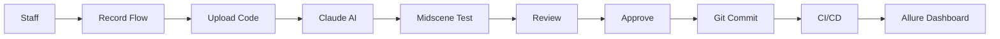

# 🤖 EDUIO Test Recorder

AI-powered test generation system for EDUIO school management platform. Staff record user flows, AI generates Midscene.js tests automatically.

## ✨ Features

- 🎬 **Easy Recording**: Staff use Playwright Codegen to record flows
- 🧠 **AI Generation**: Gemini converts recordings to Midscene tests
- 👁️ **Visual Assertions**: Gemini AI powers visual validation
- ✅ **Review Workflow**: Approve tests before committing
- 🚀 **Auto-Deploy**: Tests auto-commit to your repo
- 📊 **Allure Integration**: Results in existing dashboard
- 💰 **100% FREE**: Uses your existing Gemini API key!

## 🏃 Quick Start

### 1. Install Dependencies

```bash
npm install
```

### 2. Setup Environment

```bash
cp .env.example .env
# Edit .env with your API keys
```

### 3. Initialize Database

```bash
npx prisma migrate dev
npx prisma db push
```

### 4. Run Development Server

```bash
npm run dev
```

Visit `http://localhost:3000`

## 🎯 How It Works



## 📖 User Guide

### For Staff (Recording Tests)

1. **Start Recording**:
   ```bash
   npx playwright codegen https://school.eduio.io/login
   ```

2. **Perform Actions**: Click, type, navigate as a user would

3. **Copy Generated Code**: Playwright shows the code

4. **Upload to System**: Paste in web UI

5. **Wait for AI**: System generates Midscene test

6. **Done!** Admin approves and test runs automatically

### For Admins (Reviewing Tests)

1. **View Pending Tests**: Dashboard shows all generated tests

2. **Review Code**: Check AI-generated test code

3. **Edit if Needed**: Modify assertions or actions

4. **Approve**: Click approve to commit to repo

5. **Monitor**: Tests appear in Allure dashboard

## 🛠️ Tech Stack

- **Frontend**: Next.js 14, React, Tailwind CSS
- **Backend**: Next.js API Routes
- **Database**: SQLite (upgradeable to PostgreSQL)
- **AI**: Gemini 2.0 Flash (test generation + visual assertions)
- **Testing**: Playwright, Midscene.js
- **Deployment**: Docker, Coolify

## 📦 Project Structure

```
test-recorder-app/
├── app/
│   ├── api/              # API routes
│   │   ├── recordings/   # Recording endpoints
│   │   ├── tests/        # Test management
│   │   └── auth/         # Authentication
│   ├── page.tsx          # Dashboard UI
│   └── layout.tsx        # Root layout
├── lib/
│   ├── ai-generator.ts   # Claude AI integration
│   ├── git-service.ts    # Git operations
│   └── prisma.ts         # Database client
├── prisma/
│   └── schema.prisma     # Database schema
├── Dockerfile            # Container config
└── docker-compose.yml    # Deployment config
```

## 🔐 Environment Variables

```env
# Required
MIDSCENE_MODEL_API_KEY=AIzaSyxxxx       # Gemini API (you already have this!)

# Optional
DATABASE_URL=file:./dev.db               # Database
JWT_SECRET=your_secret                   # Auth
GIT_REPO_PATH=/path/to/testing-stack    # Git repo
```

## 🚀 Deployment

See [DEPLOYMENT.md](./DEPLOYMENT.md) for complete deployment instructions.

### Quick Deploy with Docker

```bash
docker-compose up -d
```

### Deploy on Coolify

1. Create new resource
2. Point to repository
3. Add environment variables
4. Deploy

## 📊 API Endpoints

### Recordings

- `POST /api/recordings/start` - Start recording session
- `POST /api/recordings/[id]/complete` - Upload code & generate test

### Tests

- `GET /api/tests` - List all tests
- `GET /api/tests?status=pending` - Filter by status
- `POST /api/tests/[id]/approve` - Approve and commit test

## 🧪 Testing

```bash
# Run tests
npm test

# Run in watch mode
npm run test:watch
```

## 📝 License

MIT

## 🤝 Contributing

1. Fork the repository
2. Create feature branch
3. Commit changes
4. Push to branch
5. Open pull request

## 📞 Support

For issues or questions:
- Check logs: `docker logs eduio-test-recorder`
- Review [DEPLOYMENT.md](./DEPLOYMENT.md)
- Open GitHub issue

## 🎉 Acknowledgments

- Built for EDUIO school management system
- Uses Playwright for recording
- Powered by Claude AI and Gemini
- Midscene.js for AI testing
